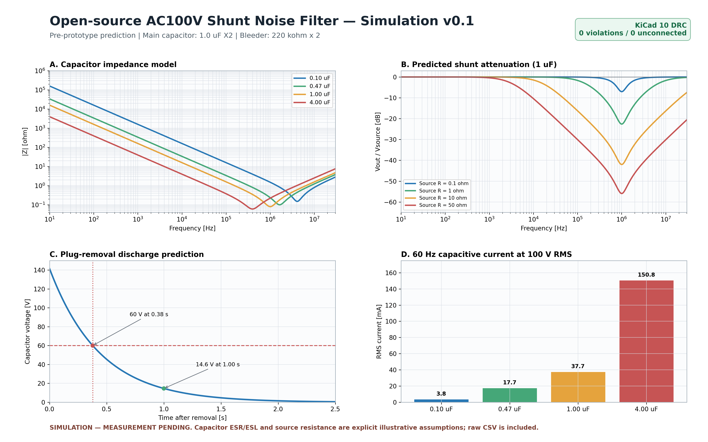

# Compact AC Parallel Filter

Compact plug-in experimental AC mains parallel network for **100 V AC, 50/60 Hz** environments.

> [!WARNING]
> ## PRE-PROTOTYPE / EXPERIMENTAL / NOT YET TESTED ON MAINS
>
> This project is currently at the **design and simulation stage only**.
>
> **No physical prototype has yet been manufactured or tested.**
>
> The schematic, PCB layout, component selection, insulation distances, enclosure, thermal behavior, surge behavior, failure modes, and noise-reduction performance have **not yet been validated on actual mains power**.
>
> This repository must **not** be interpreted as a finished, certified, production-ready, or safety-approved design.
>
> The design connects directly to hazardous mains voltage. Construction, testing, modification, or use should only be undertaken by persons with appropriate electrical-safety knowledge, equipment, and applicable regulatory review.

## Status

| Item | Current state |
|---|---|
| Version | `v0.1.1-preprototype` |
| Development stage | Design / simulation / pre-prototype |
| Target mains | 100 V AC, 50/60 Hz |
| KiCad 10 review PCB | **DRC: 0 violations / 0 unconnected pads / 0 footprint errors** |
| Physical prototype | **NOT BUILT** |
| Mains test | **NOT PERFORMED** |
| EMI/noise performance | **NOT VERIFIED** |
| Thermal test | **NOT PERFORMED** |
| Surge/fault test | **NOT PERFORMED** |
| Safety certification | **NONE** |

## Latest review material

- [KiCad hardware files](hardware/kicad/README.md)
- [KiCad 10 review PCB v0.5](hardware/kicad/review-v0.5/README.md) — 50 × 35 mm spacing/DNP study
- [KiCad 10 official DRC report](measurements/drc/DRC_KiCad10_v0_5_20260920.rpt)
- [Simulation v0.1](simulations/v0.1/simulation_assumptions_v0_1.md)
- [Simulation overview image](images/shunt_filter_simulation_overview_v0_1.png)



The simulation figures are **predictions based on disclosed assumptions**, not measurements. In particular, high-frequency performance depends on capacitor ESR/ESL, PCB and wiring inductance, outlet/source impedance, connected equipment, and placement.

## Design target

The initial concept is a compact direct plug-in parallel network using:

- **C1:** 1 µF X2 safety capacitor — KEMET R53 series
- **R1/R2:** 220 kΩ + 220 kΩ discharge network
- **F1:** Littelfuse 37402500000, 250 mA time-lag fuse
- **MOV1:** Littelfuse TMOV14RP140E thermally protected MOV
- **LED:** low-current status indicator with reverse-voltage protection
- **CMC:** not included in the initial parallel-only architecture
- **Optional C2 / RC damping:** reserved for later measurement-based evaluation

Two PCB studies are retained for review rather than silently replacing one another:

| Revision | Board | Purpose |
|---|---:|---|
| KiCad 9 Rev.A | 32 × 28 mm | compact mechanical study |
| KiCad 10 review v0.5 | 50 × 35 mm | wider spacing and DNP comparison footprints |

Neither revision is a fabrication-approved or mains-validated design.

## Project goals

1. Design the smallest practical direct plug-in PCB without sacrificing electrical-safety margins.
2. Publish the complete design process, not only favorable results.
3. Measure the effect of the network under controlled conditions.
4. Record temperature, discharge behavior, mains current, noise spectra, and failure-related observations.
5. Revise the PCB based on measured data before calling the design validated.

## Repository structure

```text
.
├─ README.md
├─ SAFETY.md
├─ CHANGELOG.md
├─ LICENSE
├─ bom/
│  └─ BOM.md
├─ docs/
│  ├─ DESIGN_NOTES.md
│  └─ TEST_PLAN.md
├─ hardware/
│  └─ kicad/
│     ├─ README.md
│     └─ review-v0.5/
├─ simulations/
│  └─ v0.1/
├─ measurements/
│  ├─ README.md
│  └─ drc/
└─ images/
```

## Development stages

### v0.1 — Pre-prototype

- schematic development
- BOM definition
- PCB layout
- enclosure study
- creepage/clearance review
- design review before manufacturing

### v0.2 — Prototype

- first PCB manufactured
- visual inspection
- continuity/isolation checks
- controlled first power-up
- mechanical fit evaluation

### v0.3 — Measurement

- mains current
- discharge time
- thermal measurements
- oscilloscope measurements
- conducted-noise comparison
- before/after data under repeatable loads

### v0.4 — Revised prototype

PCB and BOM revised from measured results.

### v1.0 — Validated open-hardware release

Only after the defined validation work has been completed and the published documentation reflects the tested hardware revision.

## Measurement policy

Negative or null results are still results.

The project intends to publish comparable measurements for:

- baseline without the network
- 1 µF network enabled
- representative resistive/electronic loads
- 50 Hz and 60 Hz where practical
- temperature and long-duration behavior
- noise spectra using identical measurement settings

No performance claim should be made from the circuit diagram or simulation alone.

## Regulatory note

Open-source publication does **not** imply compliance with Japanese PSE requirements, IEC standards, or any other product-safety or EMC requirement. Regulatory compliance, certification, and marketability are separate questions from publication of design files.

See [SAFETY.md](SAFETY.md) before working with this design.

---

## 日本語概要

このリポジトリは、AC100 Vコンセントに直接挿す小型並列回路の**設計・計算・測定過程を公開する実験的オープンハードウェアプロジェクト**です。

**現時点では実機未製作・商用電源未試験です。完成品、安全確認済み製品、認証済み製品ではありません。**

KiCad 10用レビュー基板v0.5では公式DRCを実行し、違反0・未接続0・フットプリントエラー0を確認しました。ただし、DRC合格は回路の安全性、部品定格、絶縁、筐体、熱、サージ耐性、ノイズ低減効果を保証するものではありません。

試作前のシミュレーションでは、容量別インピーダンス、電源側インピーダンス別の減衰予測、1 µF＋440 kΩの放電曲線、AC100 V・60 Hz時の容量電流を公開しています。使用した仮定と計算用データも収録し、試作後に実測値と比較できる形にしています。

初号機を製作・測定するまでは `v0.1.1-preprototype` として扱い、実測結果は成功・不成功を問わず公開する方針です。
